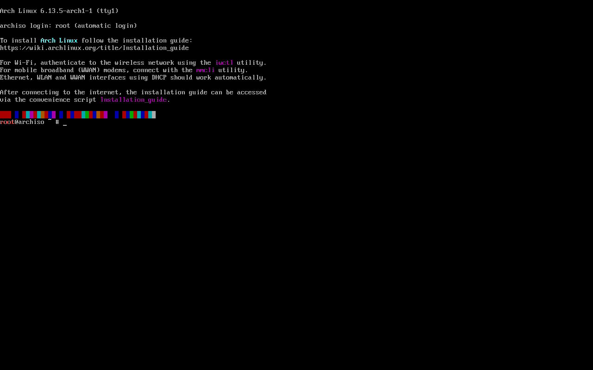
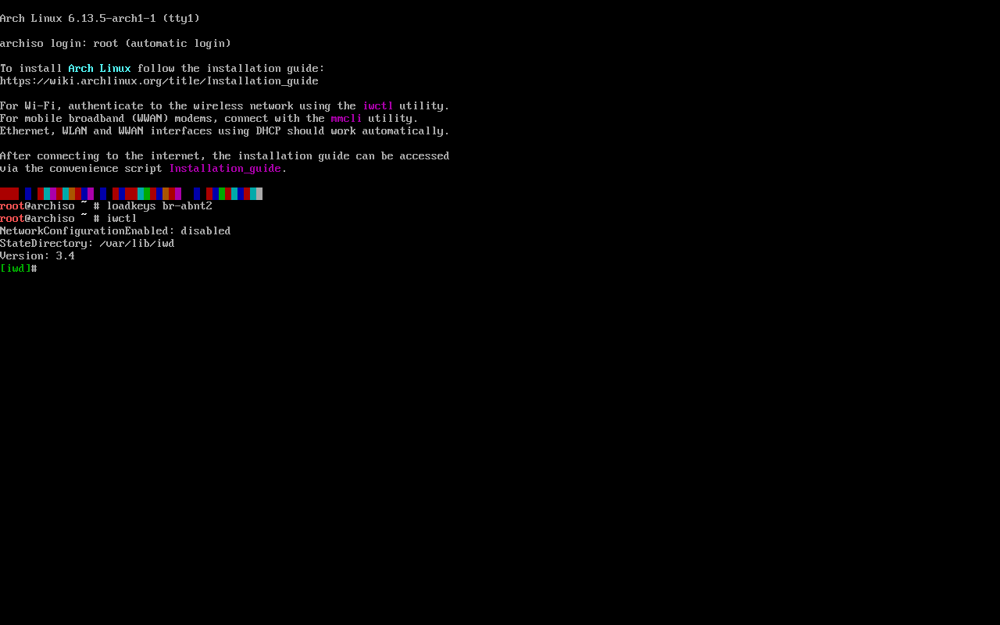
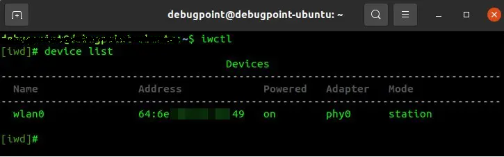
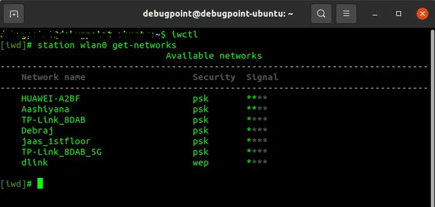
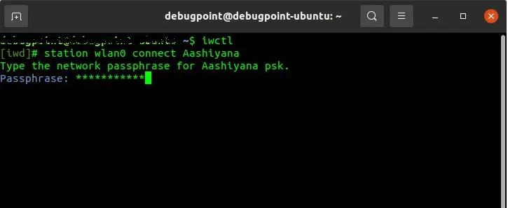

# Em Construção

## ArchLinux Installation, By Archinstall.

### Índice
[História do ArchLinux](#breve-história-sobre-o-archlinux)\
[Instalação](#instruções-de-instalação)\
[Criação do pendrive Bootavel](#criação-do-pendrive-bootável)\
[Configuração do Teclado](#configuração-do-teclado)\
[Configuração de rede](#configuração-da-rede-wi-fi)


Este projeto tem como objetivo ajudar novos usuários que estão ingressando no mundo Linux, que assim como eu, testaram várias distribuições e acabram por chegar e, preferencialmente, escolherem o ArchLinux.

Com o intuito de orientação durante a instalação básica e algumas configurações, fiz este mini tutorial para, pelo menos, conseguir efetuar a instação básica do sistema.

### Breve história sobre o ArchLinux:

Arch Linux é uma distribuição GNU/Linux de uso geral x86-64 desenvolvida de forma independente que se esforça para fornecer as versões estáveis ​​mais recentes da maioria dos softwares, seguindo um modelo de lançamento contínuo. A instalação padrão é um sistema básico mínimo, configurado pelo usuário para adicionar apenas o que for necessário propositalmente.

[Documentação](https://wiki.archlinux.org/title/Arch_Linux)

### Instruções de instalação.

#### Criação do pendrive bootável:

Primeiramente, você deve baixar o arquivo .iso do sistema ArchLinux.
Para efetuar o download, você irá acessar o site oficial da distribuição [ArchLinux](https://archlinux.org/download/).

Na página de downloads, você pode escolher entre baixar o arquivo via Torrent ou via link direto.
Obs: para baixar via torrent, você vai necessitar de um aplicativo específico (Qbitorrent ou Bitorrent).

#### Link direto com mirrors do Brasil:

#### Download via Torrent


Após o ter configurado o pendrive bootavel com o sistema, vamos iniciar a máquina com o boot selecionando o ArchLinux.

Após iniciar o sistema, você verá a seguinte tela:


#### Configuração do teclado:

Agora, para evitar erros de digitação, iremos configurar o a região do teclado com o seguite comando:

> ```shell
> loadkeys br-abnt2
> ```

Com isso, nosso teclado será configurado para o padrão abnt2 e os símbolos e letras estarão corretamente posicionados.

[loadkeys](https://wiki.archlinux.org/title/Linux_console_(Portugu%C3%AAs)/Keyboard_configuration_(Portugu%C3%AAs))

#### Configuração da rede wi-fi:

Com o teclado já configurado, iremos verificar se nossa máquina está conecctada à internet. (Opcional caso esteja conectada via cabo).
Usaremos o seguinte comando:

>```
>iwctl
>```

A seguinte tela será exibida:


Utilizar o comando "device list" para listar os dispositivos de rede disponíveis.

>```
>device list
>```
Algo parecido com isso irá aparecer:


Utilizar "station nomeDoDispositivo get-networks" para listar as redes.
Exemplo: station wlan0 get-networks, para buscar redes com o wlan0.
>```
>station seuDispositivoDeRede get-networks
>```
Algo parecido com isso irá aparecer:


Após descobrir o nome do seu dispositivo de rede e o nome da sua rede wi-fi, vamos realmente conectar sua máquina no wi-fi.

Utilize o comando a seguir:

>```
>station nomeDoDispositivo connect nomeDaSuaRede
>```

Exemplo: station wlan0 connect nomeDaSuaRede, para conectar na sua rede wi-fi.

Caso tenha sido efetuado corretamente, irá aparecer a seguinte tela:



#### OBS: O nome da rede tem que ser digitado exatamente como foi exibido no passo anterior, letras maiúsculas, minúsculas e símbolos.

Caso tudo tenha sido efetuado corretamente, será solicitada a senha da sua rede.
Digite o password da rede e tecle enter.
Será direcionado para a página inicial do iwd e nenhum erro será exibido.

Para sair do iwd, basta digitar exit e apertar enter.
Para fazer o teste, se a máquina está corretamente conectada à internet, basta fazer o test de ping.
Exemplo: ping 8.8.8.8 (DNS do Google)
Se nenhum erro for apresentado, o wi-fi foi configurado corretamente.