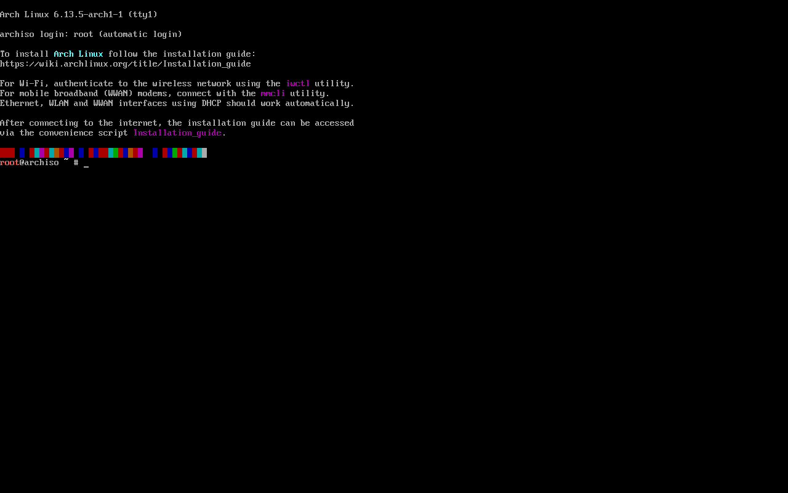

# Em Construção

## ArchLinux Installation, By Archinstall.

### Índice
[História do ArchLinux](#breve-história-sobre-o-archlinux)  
[Instalação](#instruções-de-instalação)

- [Criação do pendrive Bootável](#criação-do-pendrive-bootável)  
- [Configuração do Teclado](#configuração-do-teclado)  
- [Configuração de rede](https://github.com/zBotFragger/Connect-ArchLinux-Wi-Fi)

Este projeto tem como objetivo ajudar novos usuários que estão ingressando no mundo Linux, que assim como eu, testaram várias distribuições e acabram por chegar e, preferencialmente, escolherem o ArchLinux.

Com o intuito de orientação durante a instalação básica e algumas configurações, fiz este mini tutorial para, pelo menos, conseguir efetuar a instação básica do sistema.

### Breve história sobre o ArchLinux:

Arch Linux é uma distribuição GNU/Linux de uso geral x86-64 desenvolvida de forma independente que se esforça para fornecer as versões estáveis ​​mais recentes da maioria dos softwares, seguindo um modelo de lançamento contínuo. A instalação padrão é um sistema básico mínimo, configurado pelo usuário para adicionar apenas o que for necessário propositalmente.

[Documentação](https://wiki.archlinux.org/title/Arch_Linux)

### Instruções de instalação.

#### Criação do pendrive bootável:

Primeiramente, você deve baixar o arquivo .iso do sistema ArchLinux.
Para efetuar o download, você irá acessar o site oficial da distribuição [ArchLinux](https://archlinux.org/download/).

Na página de downloads, você pode escolher entre baixar o arquivo via Torrent ou via link direto.
Obs: para baixar via torrent, você vai necessitar de um aplicativo específico (Qbitorrent ou Bitorrent).

#### Link direto com mirrors do Brasil:

#### Download via Torrent


Após o ter configurado o pendrive bootavel com o sistema, vamos iniciar a máquina com o boot selecionando o ArchLinux.

Após iniciar o sistema, você verá a seguinte tela:


#### Configuração do teclado:

Agora, para evitar erros de digitação, iremos configurar o a região do teclado com o seguite comando:

```
loadkeys br-abnt2
```
Com isso, nosso teclado será configurado para o padrão abnt2 e os símbolos e letras e acentos estarão corretamente posicionados.

Verifique a documentação referente à configuração do teclado no site oficial do sistema [loadkeys](https://wiki.archlinux.org/title/Linux_console_(Portugu%C3%AAs)/Keyboard_configuration_(Portugu%C3%AAs)).
